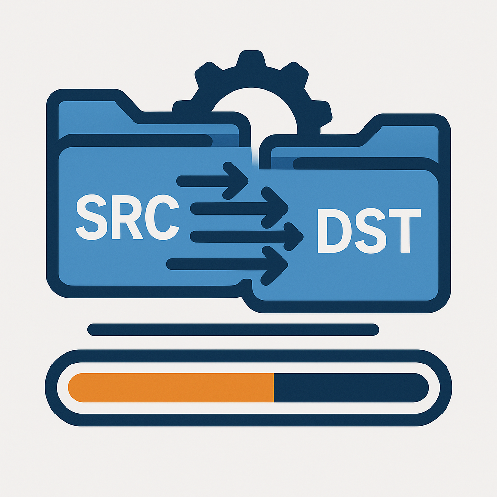

<div align="center">
  
  <h1>Parallel Copy</h1>
</div>

A multithreaded file copying utility for efficiently copying large directories and files by leveraging parallel processing.

## Features

- **Multithreaded copying**: Copy files in parallel to maximize throughput
- **Progress tracking**: Real-time progress bar showing copy status
- **File comparison**: Optional shallow comparison to skip identical files
- **Error handling**: Graceful handling of permissions and other errors
- **Human-readable output**: File sizes displayed in human-readable format

## Install it from Git

```bash
pip install git+https://git.nas.tanganke.com/tanganke/parallel_copy.git
```

## Usage

### Command Line Interface

```bash
# Basic usage
parallel_copy SOURCE_DIR DESTINATION_DIR

# Use 8 threads for copying
parallel_copy SOURCE_DIR DESTINATION_DIR -t 8

# Enable shallow comparison to skip identical files
parallel_copy SOURCE_DIR DESTINATION_DIR --shallow-compare
```

### As a Python Library

```python
from parallel_copy import ParallelCopy

# Initialize with source and destination directories
copy_task = ParallelCopy(
    src="/path/to/source",
    dest="/path/to/destination",
    threads=4,
    shallow_compare=True
)

# Start the copy operation
copy_task()
```

## Command Line Options

| Option | Description |
|--------|-------------|
| `src` | Source directory (required) |
| `dest` | Destination directory (required) |
| `-t, --threads` | Number of threads to use (default: 4) |
| `--shallow-compare` | Skip copying if destination file exists with same size and modification time |

## Development

Read the [CONTRIBUTING.md](CONTRIBUTING.md) file.
